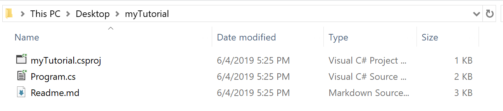

In our [previous post](https://devblogs.microsoft.com/dotnet/creating-interactive-net-documentation/), we announced the `dotnet try` global tool that enables developers to create workshops and write content that can give a more interactive and engaging experience for the users. This tool can greatly enhance the way the end users learn from your documentation by giving them hands on experience, without having to install any editor.

Today, we are announcing the availability of a new dotnet template called "trydotnet-tutorial". This template can be installed as part of the other "dotnet new" templates and can then be used to create a "getting started" basic code to help content authors understand the basics of the "dotnet try" tooling and then be able to write their own awesome documentation with it.

## Setup
To set this up, let's begin by installing the template. In a command prompt execute, 
```console
dotnet new -i Microsoft.DotNet.Try.ProjectTemplate.Tutorial --nuget-source https://dotnet.myget.org/F/dotnet-try/api/v3/index.json
```

Once succeeded it should print the available templates for dotnet new and the "trydotnet-tutorial" should be one them.

<p align ="center">

</p>

Also, you need to install the `dotnet try` global tool, if you haven't already
```console
dotnet tool install -g dotnet-try
```

## Using the template

Let's create a folder to contain your tutorial project and execute
```console
dotnet new trydotnet-tutorial
```

In this case, my folder name is "my_tutorial", which resulted in the file structure below

<p align ="center">

</p>

> [!TIP]
> You can also use the --name argument like
> `dotnet new trydotnet-tutorial --name my_tutorial`
> This would create a new folder in your current working directory with the same structure as above.

Now, let's see the template in action. In the my_tutorial folder, execute
```console
dotnet try
```

This would start the dotnet try process and spin up a browser window with the interactive readme. You can click the "Run" button in the browser and see the Program running in action. If you type in the editor you will also get diagnostics and intellisense. Try modifying the code here and execute to see the changes.

<p align ="center">

</p>

## Understanding the template

The files in a trydotnet-tutorial will typically be one of the three categories:

### Markdown files

These are the files that will serve as your documentation. These are pretty much like the normal markdown files with some custom settings to enable them to be rendered interactively by the `dotnet try` engine.
In the Readme.md file, notice that the code fences(the ``` notation used to denote code in markdown format) have some special arguments like `--source-file`, `--region`, etc and you actually don't see any code inside the fences. However when we are running the dotnet try process, we are able to see and execute code in place of this code fence. Let's get back to this later.

### Project File

The my_tutorial.csproj is a normal project file against which your source code will be compiled and run.

### Source Files

These are the files that contain the code that will be executed. For simplicity, the template has only once source file, ie, Program.cs, however you can have more than one files and refer the code present in those files. 

Looking into the Program.cs, you will notice that instead of the familiar `Main(string[] args)` entry point, this program's entry point uses the new experimental library [System.CommandLine.DragonFruit](https://github.com/dotnet/command-line-api/wiki/DragonFruit-overview) to parse the arguments that were specified in your Markdown file's code fence. The `Readme.md` sample uses these arguments to route to different methods, but you can probably think of other ways to use these arguments. You're not required to use any particular library in your backing project. But the command line arguments are available if you want to respond to them, and `DragonFruit` is a concise option for doing so.

## What's happening behind the scenes

Code fences are a standard way to include code in your markdown files. The only change you need to do is to add a few options in the first line of your code snippet. If you notice the above code snippet, there are three options in action.

| Option                                 | What it does                                                                                                                |
|----------------------------------------|-----------------------------------------------------------------------------------------------------------------------------|
| `--project ./my_tutorial.csproj` | Points to the project that the sample is part of. (Optional. Defaults to any .csproj in the same folder as the `.md` file.) |
| `--region HelloWorld`                        | Identifies a C# code `#region` to focus on. (Optional. If not specified, the whole file is displayed in the editor.)         |
| `--source-file ./Program.cs`  | Points to the file where the sample code is pulled from.  

If you navigate back to Program.cs you will be able to see the various regions and the context in which your code is being executed.

You're all set! Now you can tweak and play around with the template and create awesome interactive tutorials. 

You can learn more or reach out to us on [GitHub](https://github.com/dotnet/try).
