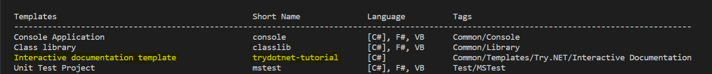

In our [previous post](https://devblogs.microsoft.com/dotnet/creating-interactive-net-documentation/), we announced the `dotnet try` global tool that enables developers to create workshops and write content that can give a more interactive and engaging experience for the users. This tool can greatly enhance the way the end users learn from your documentation by giving them hands on experince, wihout having to install any editor.

Today, we are announcing the avaialability of a new dotnet template called "trydotnet-tutorial". This template can be installed as part of the other "dotnet new" templates and can then be used to create a "getting started" basic code to help content authors understand the basics of the "dotnet try" tooling and then be able to write their own awesome documentation with it.

## Setup
To set this up, let's begin by installing the template. In a command prompt execute, 
```console
dotnet new -i Microsoft.DotNet.Try.ProjectTemplate.Tutorial --nuget-source https://dotnet.myget.org/F/dotnet-try/api/v3/index.json
```

Once succeeded it should print the available templates for dotnet new and the "trydotnet-tutorial" should be one them.

<p align ="center">

</p>

Also, if you should install the `dotnet try` global tool, if you haven't already
```console
dotnet tool install -g dotnet-try
```

## Using the template

Let's create a folder to contain your tutorial project and execute
```console
dotnet new trydotnet-tutorial
```

In this case my folder name is my_tutorial, which resulted in the file structure below

<p align ="center">

</p>

> [!TIP]
> You can also use the --name argument like
> dotnet new trydotnet-tutorial --name my_tutorial
> This would create a new folder in your current working directory with the same structure as above.

Now, let's see the template in action. In the my_tutorial folder, execute
```console
dotnet try
```

This would start the dotnet try process and spin up a browser window with the interactive readme. You can click the "Run" button in the browser and see the Program running in action. You can also modify the code here and execute to see the changes.

<p align ="center">

</p>

## Understanding the template

The template has the following files:


1. Readme.md: The markdown file that will function as your documentation. This is prettIf you look carefully, the code fences(the ``` notation used to denote code in markdown format) has some additional arguments like `--source-file`, `--region`, etc and you actually dont see any code in the snippets. We will get back to this later.
1. Program.cs: Your application code. The sample here uses the System.CommandLine DragonFruit package to parse the command line options and execute the code accordingly.

2. my_tdn_tutorial.csproj: The project file for your tutorial

The Readme.md provides a further deep-dive into the code fence options that are being utilized. On a high level, the code fence options refer to the source file Program.cs and uses the --region option to execute a specific code path. 

You may have noticed that the signature of `Program.Main` in the [QuickStart](./QuickStart.md)'s backing project (`Snippets.csproj`) looks a little strange:

```
```cs --source-file ./Program.cs --project ./my_tdn_tutorial.csproj --region HelloWorld
```

Instead of the familiar `Main(string[] args)` entry point, this program's entry point uses the new [experimental library](https://github.com/dotnet/command-line-api/wiki/DragonFruit-overview) `System.CommandLine.DragonFruit` to parse the arguments that were specified in your Markdown file's code fence. The `Readme.md` sample uses these arguments to route to different methods, but you can probably think of other ways to use these arguments. As you saw from the tutorial, you're not required to use any particular library in your backing project. But the command line arguments are available if you want to respond to them, and `DragonFruit` is a concise option for doing so.

Now you can tweak and play around with the template and create awesome interactive tutorials. 

You can learn more or reach out to us on [GitHub](https://github.com/dotnet/try).
